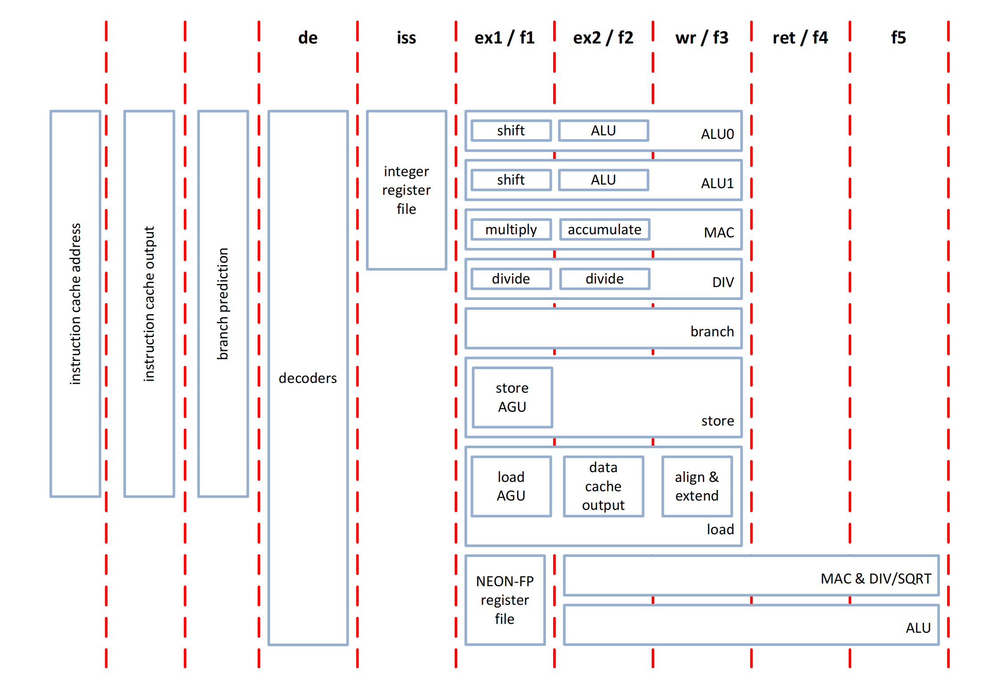
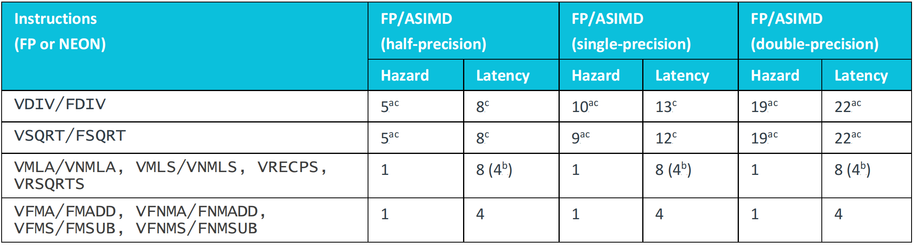

# ARM Cortex A55

## Pipeline

- Cortex-A55 对于整数指令有8级深度的流水线，对于浮点(FP)和高级SIMD有10级深度流水线 (ASIMD)指令。
- The pipeline stages in the main datapath are *iss*, *ex1*, *ex2*, *wr*, and *ret*. Integer instructions are issued in-order from the *iss* (issue) pipeline stage and complete in the *wr* (writeback) pipeline stage. 
- The pipeline stages in the NEON-FP datapath are *f1*, *f2*, *f3*, *f4*, and *f5*. Floating-point or NEON instructions read their operands in the *f1* pipeline stage and normally complete in the *f5* pipeline stage. 

### bypass 通路

为了降低流水线气泡，而设计的bypass通路。 例如先写后读，第二条指令需要第一条指令的结果，在流水线阶段第一条指令ALU 计算的结果可以转发。

- ALU 末尾阶段可以转发给ALU，DIV，MAC， Load初始阶段。还有一个专用的路径ALU0 到ALU1 和ALU1到ALU0。
- The DIV pipeline can only accept operands in the *iss* stage and will only forward results from the *wr* stage.
- ~~还有一些内容未理解~~
- With the exception of system register read results, all integer results can be forwarded from the *wr* stage.

### **Dual-issue**

- Data-processing 所有的数据指令都可以双发射， 除了以下：
  - Instructions that want to write to the program counter.
- Load/store  基本都可以双发射，除了以下：
  - Load/store multiple instructions. (**这个是否是值得没有内存对齐的ld st呢?**)
  - Instructions that want to write to the program counter.
- Advanced SIMD 除了以下：
  - Load/store instructions of more than one cycle.
  - Certain multi-cycle data-processing instructions.

### **Load/store and address generation**

- 这节内容完全没有看懂

### **Integer divide and multiply-accumulate units**

- 定点的出发和MAC， 没看

### **Floating-point and NEON instructions**

- Hazard

  - A VDIV instruction after a VSQRT instruction must wait for the datapath resource to free up.  (猜测:这两个运算单元上用重复利用部分)

  - A VMLA instruction after a VSQRT instruction is not blocked, as VMLA does not use the divide or square-root resource. 

  - A VSQRT after a VMLA would be able to issue immediately, provided there was no previous op using the divide or 

    square-root resource, as a value of 1-cycle indicates that the resource will not block and supports single cycle back to-back operation.

- *Latency:*

  -  The number of cycles between when the operands are required, and the result is available for forwarding.  (猜测: 先写后读)

  - **b** Indicates the number of cycles between multiply-accumulate instructions if the only dependency is the accumulate 

    operand. In other words, the accumulate forwarding latency. (MAC 特殊)

## **Instruction characteristics**

