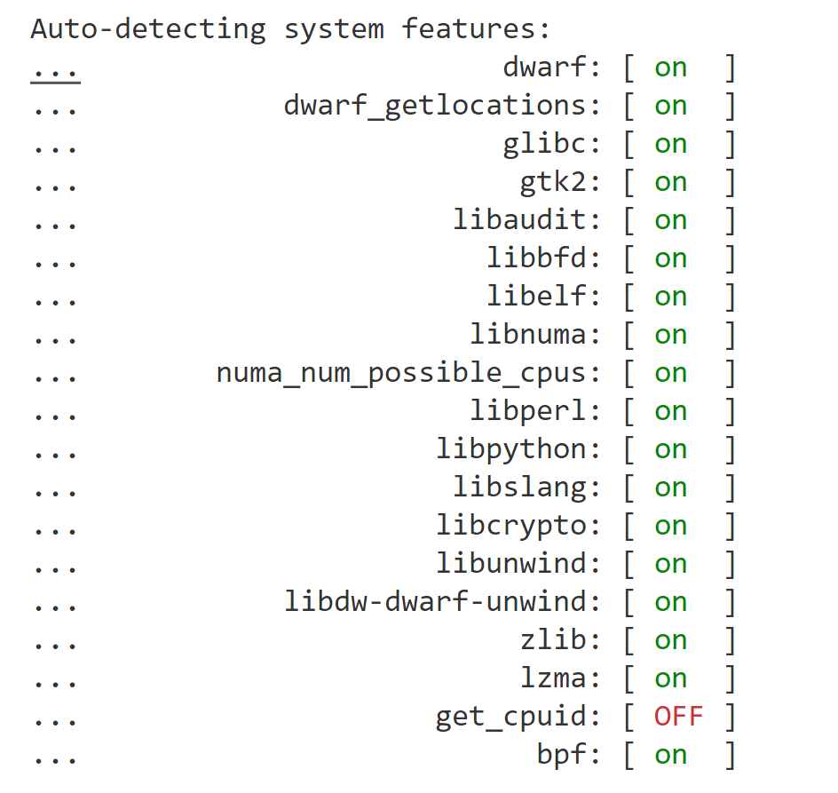

# Perf


##  安装

- 1 查看xavier 版本 `head -n 1 /etc/nv_tegra_release`

  L4T 版本R32.4.3

  ```shell
  head -n 1 /etc/nv_tegra_release
  # R32 (release), REVISION: 4.3, GCID: 21589087, BOARD: t186ref, EABI: aarch64, DATE: Fri Jun 26 04:34:27 UTC 2020
  ```

  

- **2** 下载 kernel  [版本链接](https://developer.nvidia.com/embedded/jetson-linux-archive)  选择对应版本[R32.4.3](https://developer.nvidia.com/embedded/linux-tegra-r32.4.3)  [下载源码](https://developer.nvidia.com/embedded/L4T/r32_Release_v4.3/Sources/T186/public_sources.tbz2)。 进入linux 源码 `kernel-4.9/tools/perf`目录。

- **3**  安装依赖`sudo apt install -y libperl-dev libdwarf-dev  systemtap-sdt-dev  `    。编译源码的时候会提示缺少的依赖按照要求安装即可， `get_cpuid` 未解决

  

## 使用


### stat

- event

  ```
  List of pre-defined events (to be used in -e):
  
    armv8_pmuv3/br_mis_pred/                           [Kernel PMU event]
    armv8_pmuv3/br_mis_pred_retired/                   [Kernel PMU event]
    armv8_pmuv3/br_pred/                               [Kernel PMU event]
    armv8_pmuv3/br_retired/                            [Kernel PMU event]
    armv8_pmuv3/cid_write_retired/                     [Kernel PMU event]
    armv8_pmuv3/cpu_cycles/                            [Kernel PMU event]
    armv8_pmuv3/exc_return/                            [Kernel PMU event]
    armv8_pmuv3/exc_taken/                             [Kernel PMU event]
    armv8_pmuv3/inst_retired/                          [Kernel PMU event]
    armv8_pmuv3/l1d_cache/                             [Kernel PMU event]
    armv8_pmuv3/l1d_cache_refill/                      [Kernel PMU event]
    armv8_pmuv3/l1d_cache_wb/                          [Kernel PMU event]
    armv8_pmuv3/l1d_tlb_refill/                        [Kernel PMU event]
    armv8_pmuv3/l1i_cache/                             [Kernel PMU event]
    armv8_pmuv3/l1i_cache_refill/                      [Kernel PMU event]
    armv8_pmuv3/l1i_tlb_refill/                        [Kernel PMU event]
    armv8_pmuv3/mem_access/                            [Kernel PMU event]
    armv8_pmuv3/memory_error/                          [Kernel PMU event]
    armv8_pmuv3/stall_backend/                         [Kernel PMU event]
    armv8_pmuv3/stall_frontend/                        [Kernel PMU event]
    armv8_pmuv3/sw_incr/                               [Kernel PMU event]
    armv8_pmuv3/ttbr_write_retired/                    [Kernel PMU event]
    carmel_pmu/bus_access/                             [Kernel PMU event]
    carmel_pmu/bus_cycles/                             [Kernel PMU event]
    carmel_pmu/l2d/                                    [Kernel PMU event]
    carmel_pmu/l2d_cache_wb/                           [Kernel PMU event]
    carmel_pmu/l2d_ld/                                 [Kernel PMU event]
    carmel_pmu/l2d_prefetch_c0/                        [Kernel PMU event]
    carmel_pmu/l2d_prefetch_c1/                        [Kernel PMU event]
    carmel_pmu/l2d_refill/                             [Kernel PMU event]
    carmel_pmu/l2d_refill_ld/                          [Kernel PMU event]
    carmel_pmu/l2d_refill_st/                          [Kernel PMU event]
    carmel_pmu/l2d_refill_victim/                      [Kernel PMU event]
    carmel_pmu/l2d_st/                                 [Kernel PMU event]
    carmel_pmu/l3d_cache/                              [Kernel PMU event]
    carmel_pmu/l3d_cache_allocate/                     [Kernel PMU event]
    carmel_pmu/l3d_cache_refill/                       [Kernel PMU event]
    carmel_pmu/l3d_cache_wb/                           [Kernel PMU event]
  ```

  
