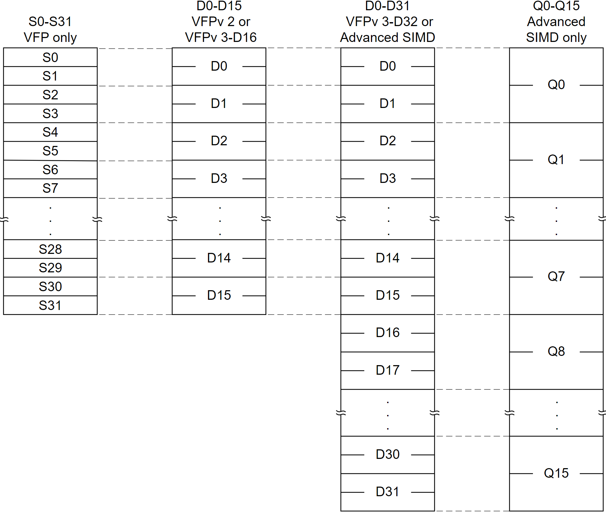
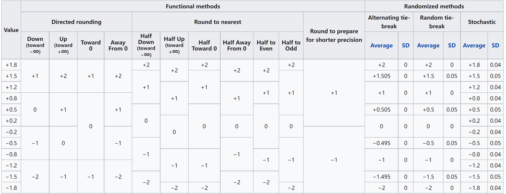

# NEON


- 编译选项
  - -mfpu=neon


## 寄存器

### 寄存器

64bit 和128bit两种类型寄存器， Dn 表示64bit，Qn表示128bit。 在`armv8` 下 `Q0`可以由`D0,D1`组合。
    

## 汇编

armv7 和armv8 指令在格式和种类上差异非常大。（会主要整理armv8）

其中有一些相同的语法格式 

-  **1** {}, 表示可选项
-  **2** <>, 表示必选项

```nasm
armv7
V{<mod>}<op>{<shape>}{<cond>}{.<dt>}<dest1>{,<dest2>},<src1>{,<src2>}
armv8
{<prefix>}<op>{<suffix>} Vd.<T>, Vn.<T>, Vm.<T>
```

### ARMv7


### ARMv8

基本格式

```
{<prefix>}<op>{<suffix>}  Vd.<T>, Vn.<T>, Vm.<T>
```
- **1 <prefix>**

    - **S/U/F/P**：表示数据类型，分别为 **有符号整型/无符号整型/浮点型/布尔型**。
    - **Q**：表示饱和（Saturating）计算。
    - **R**：表示舍入（Rounding）计算, Rounding 操作等价于加上 0.5 之后再截断。
    - H：表示折半（Halving）计算。
    - **D**：表示翻倍（Doubling）计算。
    
- **2<op>** 表示具体的操作，例如 `ADD`，`SUB` 等等

- **3 <suffix>** 表示后缀名字

    - **V**：表示 Reduction 计算。
    - **P**：表示 Pairwise 计算。
    - **H**：表示结果只取每个通道的高半部分（High）。
    - **L/N/W/L2/N2/W**2：表示数据长度的变化
      - **L / L2 ：**表示输出向量是输入向量长度的 2 倍，其中 L 表示输入寄存器的低 64bit 数据有效，L2 表示输入寄存器的高 64bit 数据有效。
      - **N/N2：**表示输出向量是输入向量的 1/2 倍，N 表示输出向量只有低 64bit 有效，N2 则表示输出向量只有高 64bit 有效。
      - **W/W2：**表示输出向量和第一个输入向量长度相等，且这两个向量是第二个向量长度的 2 倍，其中 W 表示第二个输入向量的低 64bit 有效，W2 表示第二输入向量的高 64bit 有效。
    
- **4 <T>** 表示单个通道的数据类型，**8B/16B/4H/8H/2S/4S/2D**，B 表示 8bit，H 表示 16bit，S 表示 32bit，D 表示 64bit。


NEON Demo

## Intrinsics 函数

### 数据类型

  - **非数组向量格式**

    ```c
    <基本类型>x<lane个数>_t   如int8x8_t
    基本类型int8，int16，int32，int64，uint8，uint16，uint32，uint64，float16，float32
    lane个数表示并行处理的基本类型数据的个数（通道数）
    ```

  - **数组向量格式**
    
      ```c
      <基本类型>x<lane个数>x<向量个数>_t    如 uint8x8x3_t
      对于多个向量的类型实际上是结构体
      typedef struct {
        uint8x8_t val[3];
      } uint8x8x3_t;
      ```

### 函数格式

  v<**1** 模型><**2** 指令名><**3** sharp>[**4** 后缀]_<**5** 数据类型>

  - **1** <模型>

    - **q**：饱和计算 （Saturating）

      ```c
      // a加b的结果做饱和计算
      int8x8_t vqadd_s8(int8x8_t a, int8x8_t b);
      ```

    - **h**：折半计算 （Halving)

      ```c
      // a减b的结果右移一位
      int8x8_t vhsub_s8(int8x8_t a, int8x8_t b);
      ```

    - **d**：加倍计算（Doubling）

      ```c
      // a乘b的结果扩大一倍, 最后做饱和操作
      int32x4_t vqdmull_s16(int16x4_t a, int16x4_t b);
      ```

    - **r**：舍入计算（Rounding）

      ```c
      // 将a与b的和减半,同时做rounding 操作, 每个通道可以表达为: (ai + bi + 1) >> 1
      int8x8_t vrhadd_s8(int8x8_t a, int8x8_t b);
      ```

    - **p**：pairwise计算

      ```c
      // 将a, b向量的相邻数据进行两两和操作
      int8x8_t vpadd_s8(int8x8_t a, int8x8_t b);
      ```

  - **2** <指令名>表示具体操作，比如 `add`，`sub`。

  - **3** <sharp>

    - **l**：long 长指令

      ```c
      输出数据的基本类型位数是输入的2倍，例如
      uint16x8_t vaddl_u8(uint8x8_t a, uint8x8_t b);
      ```

    - **n**：narrow 窄指令

      ```c
      输出数据的基本类型位数是输入的一半，例如
      uint32x2_t vmovn_u64(uint64x2_t a);
      ```

    - **w：**wide 第一个输入向量和输出向量类型一样，且是第二个输入向量元素长度的2倍

      ```c
      uint16x8_t vsubw_u8(uint16x8_t a, uint8x8_t b);
      ```

    - **_high**：AArch64专用，而且和 l/n 配合使用。当使用 l(Long) 时，表示输入向量只有高 64bit 有效；当使用 n(Narrow) 时，表示输出只有高 64bit 有效。

      ```c
       // a 和 b 只有高 64bit 参与运算
      int16x8_t vsubl_high_s8(int8x16_t a, int8x16_t b);
      ```

    - **_n**：有标量参与向量计算

      ```c
      // 向量 a 中的每个元素右移 n 位
      int8x8_t vshr_n_s8(int8x8_t a, const int n);
      ```

    - **_lane**： 指定向量中某个通道参与向量计算

      ```c
      // 取向量 v 中下标为 lane 的元素与向量 a 做乘法计算
      int16x4_t vmul_lane_s16(int16x4_t a, int16x4_t v, const int lane);
      ```


  - **4** 后缀如果没有，表示64位并行；如果后缀是q，表示128位并行。
- **5** <数据类型> 数据类型：s8，s16，s32，s64，u8，u16，u32，u64，f16，f32，f64

### 数据转换

- **浮点转定点舍入**, IEEE754规定了很多种舍入规则, 如: 四舍五入到最近值, 四舍五入到最近偶数值,等.  [舍入规则](https://en.wikipedia.org/wiki/Rounding)

  

  ```c
  vcvta_s32_f32()  // 四舍五入到最近接的数值
  vcvtn_s32_f32()  // 四舍五入到最接近的偶数
  vcvtm_u32_f32()  // 向负无穷舍入
  vcvtp_s32_f32()  // 向正无穷舍入
  ```

  

- 

## 访存操作

​	基本操作有`pfrm`，`ld1`，`st1`，`pld`，`vld`

- **1** `pfrm`
- **2** `ld1`
- **3** `st1`
- **4** `pld`
- **5** `vld`

## Instruction


### 参考

- 1 https://www.uio.no/studier/emner/matnat/ifi/INF5063/h17/timeplan/armv8-neon.pdf
- 2 https://icode.best/i/03465444677461
- 3 https://blog.csdn.net/liyunlong19870123/article/details/121810578
- 4 [neon指令速查](https://blog.csdn.net/billbliss/article/details/78924636)
- 5 [Coding for NEON - Part 1: Load and Stores](https://community.arm.com/processors/b/blog/posts/coding-for-neon---part-1-load-and-stores)
- 6 [Coding for NEON - Part 2: Dealing With Leftovers](https://community.arm.com/processors/b/blog/posts/coding-for-neon---part-2-dealing-with-leftovers)
- 7 [Coding for NEON - Part 3: Matrix Multiplication](https://community.arm.com/processors/b/blog/posts/coding-for-neon---part-3-matrix-multiplication)
- 8 [Coding for NEON - Part 4: Shifting Left and Right](https://community.arm.com/processors/b/blog/posts/coding-for-neon---part-4-shifting-left-and-right)
- 9 [Coding for NEON - Part 5: Rearranging Vectors](https://community.arm.com/processors/b/blog/posts/coding-for-neon---part-5-rearranging-vectors)
- 10 [Neon 指令集 ARMv7/v8 对比](https://blog.csdn.net/zsc09_leaf/article/details/45825015)
- 11 [Neon Intrinsics各函数介绍](https://blog.csdn.net/fengbingchun/article/details/38085781)
- 12 [ARMv7 NEON内在函数和数据类型](https://blog.csdn.net/waterhawk/article/details/83932098)
- 13  [常用的汇编指令](https://jzwdsb.github.io/2018/07/neon_frequently_use/)
- 14 [NEON 指令介绍](https://zhuanlan.zhihu.com/p/441686632)
- https://zhuanlan.zhihu.com/p/479398400
- [常用函数介绍](https://blog.csdn.net/Windgs_YF/article/details/112629405)


## 临时记录


### 倒数引起的浮点异常

CPACR_EL1, CPTR_EL2, and CPTR_EL3 registers

```
Method vrecpeq_f32
vrecpeq_f32(v128)
Floating-point Reciprocal Estimate. This instruction finds an approximate reciprocal estimate for each vector element in the source SIMD&FP register, places the result in a vector, and writes the vector to the destination SIMD&FP register.This instruction can generate a floating-point exception. Depending on the settings in FPCR, the exception results in either a flag being set in FPSR or a synchronous exception being generated. For more information, see Floating-point exception traps.Depending on the settings in the CPACR_EL1, CPTR_EL2, and CPTR_EL3 registers, and the current Security state and Exception level, an attempt to execute the instruction might be trapped.
Equivalent instruction: FRECPE Vd.4S,Vn.4S
```

- 数据转换

  ```
  vreinterpretq_u32_f32()
  vreinterpretq_f32_u32()
  ```
  
  
  
- fause mul add

  主要差别在于[舍入](https://en.wikipedia.org/wiki/Rounding)次数， FMA 只有一次舍入， MLA有两次舍入。

  - armv7 vfpv4 fma快一点点点， vfpv3 不支持 fma。
  - arm64 上两个一样

  ```
  vfmaq_f32
  vfmaq_n_f32
  vmlaq
  ```

  [arm论坛回答](https://community.arm.com/support-forums/f/infrastructure-solutions-forum/48947/difference-between-vfma-and-vmla-in-neon)
  [wiki 解释](https://en.wikipedia.org/wiki/Multiply%E2%80%93accumulate_operation)

- 
