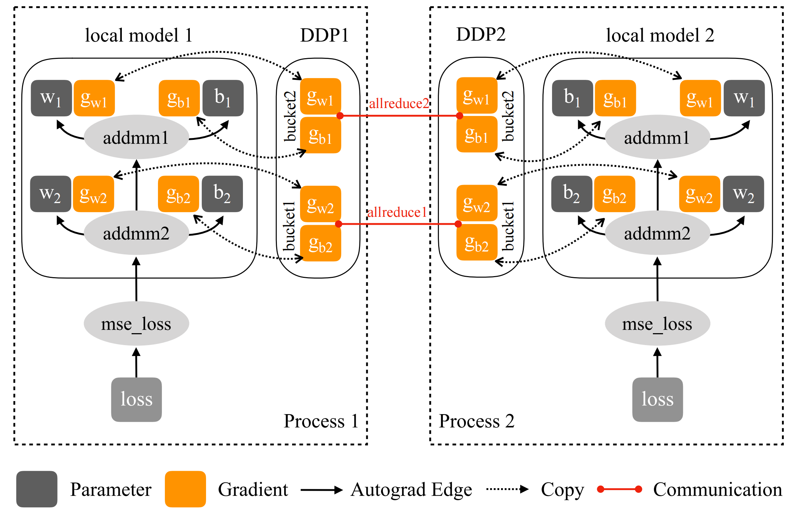

# DDP

- allreduce， ring allreduce 

## 参考资料

- https://arshren.medium.com/how-to-distribute-deep-learning-model-training-693a1898918f
- [pytorch tutorial](https://pytorch.org/tutorials/beginner/dist_overview.html#)
- [paper](https://arxiv.org/pdf/2006.15704.pdf)

- [pytorch ddp](https://dev-discuss.pytorch.org/t/torchdynamo-update-9-making-ddp-work-with-torchdynamo/860)
- [计算图](https://colah.github.io/posts/2015-08-Backprop/)

