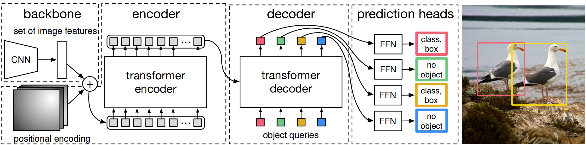
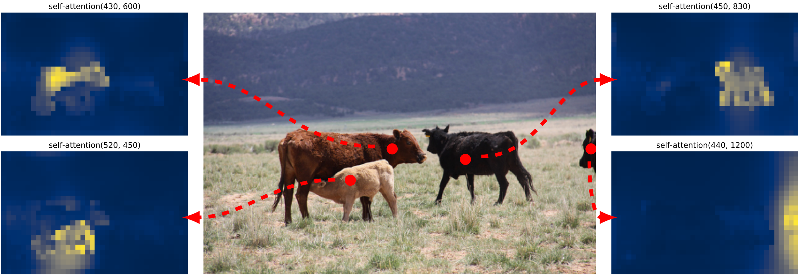

# DETR

[github](https://github.com/facebookresearch/detr) , [paper](https://arxiv.org/pdf/2005.12872.pdf)

## 总结

先全局范围内粗略搜，然后用放大镜精确锁定目标。与之前的目标检测有差别（一阶段yolo，二阶段rcnn）

### 优点

- 省去了nms，省去了anchor。
- 分类精度更高。

### 缺点

- 训练时间长。
- 小目标检测差。

## 网络

### encoder

### decoder

### 输出

