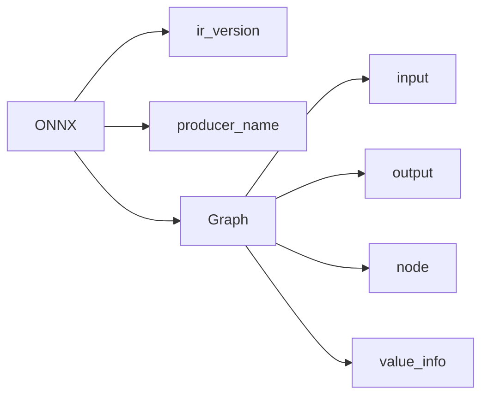

# ONNX

## ONNX Protobuf

[onnx.proto](https://github.com/onnx/onnx/blob/master/onnx/onnx.proto) , [onnx.proto3](https://github.com/onnx/onnx/blob/main/onnx/onnx.proto3)

```mermaid
graph LR
ONNX --> ir_version
ONNX --> producer_name
ONNX --> Graph


Graph --> input
Graph --> output
Graph --> node
Graph --> value_info
```

