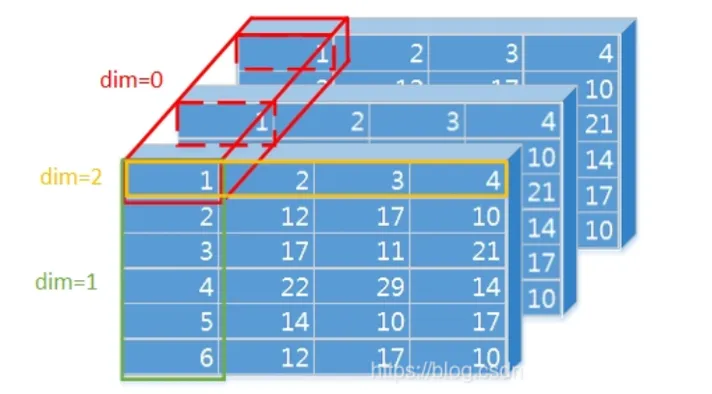

# softmax

## 公式

$$
Softmax(x_i)=\frac{exp(x_j)}{∑_j exp(x_j)}
$$

## torch 接口

- input (Tensor) – input
- dim (int) – A dimension along which softmax will be computed.
- dtype (torch.dtype, optional) – the desired data type of returned tensor. If specified, the input tensor is casted to dtype before the operation is performed. This is useful for preventing data type overflows. Default: None.

### dim 定义

简单的理解为softma计算后某一个dim和是1


| 00   | 01   |
| ---- | ---- |
| 10   | 11   |

```
dim = 0, [00, 01], [10, 11]  行方向
dim = 1, [00, 10], [01, 11]  列方向
```

同理可以推广到 3维 4维

