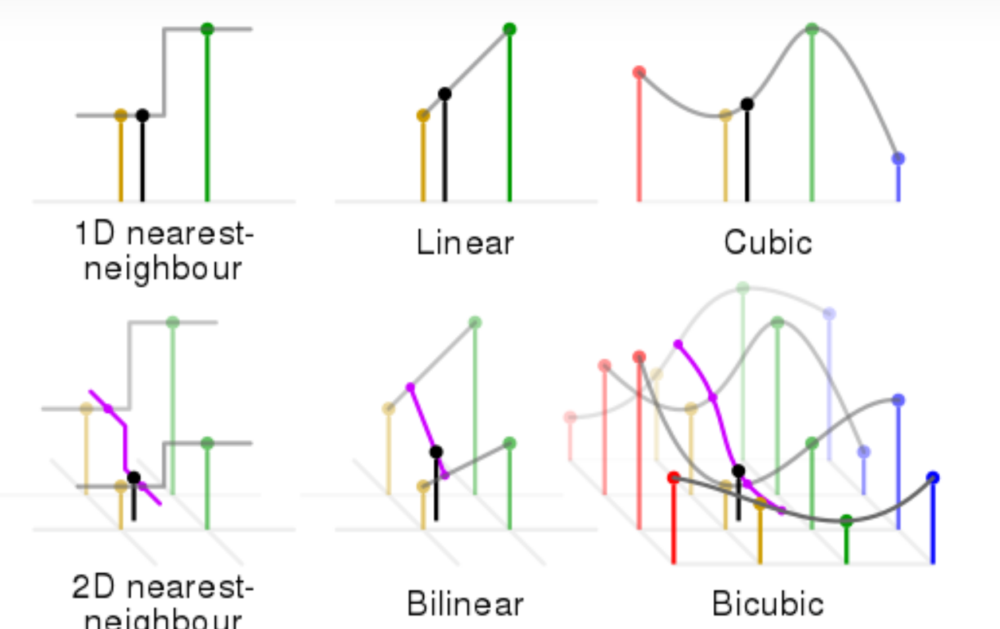

# Resize




## Nearest


## Bilinear

- code

  ```
  x=torch.randn([1, 1, 3, 3])
  y0 = F.interpolate(x, scale_factor=2,mode='bilinear',align_corners=False)
  y1 = F.interpolate(x, scale_factor=2,mode='bilinear',align_corners=True)
  ```

  

- align : True or False

  


## Bicubic


## OPENCV 实现

### bilinear 

- 4.6.0 naive

  ```c++
  // 缩放采用Q11  16bit
  
  const int INTER_RESIZE_COEF_BITS=11;
  const int INTER_RESIZE_COEF_SCALE=1 << INTER_RESIZE_COEF_BITS;
  
  // alpha x INTER_RESIZE_COEF_SCALE
  // 中间计算采用32bit  8u x q11 = 
  ```

- 四舍五入误差

  ```c++
  round
  // opencv
  __builtin_lrintf
  ```

  

- 调用栈

  ```
  HResizeLinearVec_X4
  VResizeLinearVec_32f
  VResizeLinear
  resizeGeneric_Invoker
  ```

  
