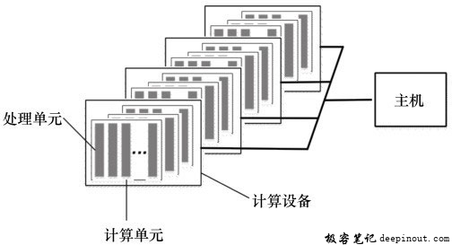
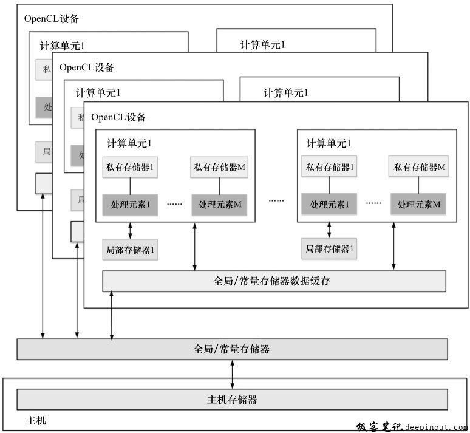
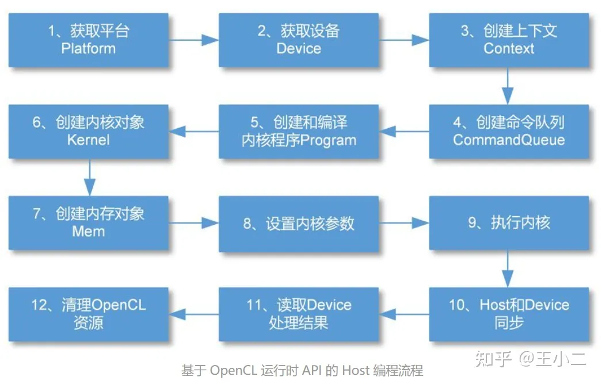

# OpenCL

## 简介

**OpenCL**全称为Open Computing Language（开放计算语言），先由Apple设计，后来交由Khronos Group维护，是异构平台并行编程的开放的标准，也是一个编程框架。OpenCL支持数据并行任务并行。同时OpenCL内建了多GPU并行的支持。这使得OpenCL的应用范围比CUDA广。为了能适用于一些更低端的嵌入式设备（如DSP+单片机这种环境），OpenCL API基于纯C语言进行编写。Khronos Group是一个非盈利性技术组织，维护着多个开放的工业标准，并且得到了业界的广泛支持。OpenCL的设计借鉴了CUDA的成功经验，并尽可能地支持多核CPU、GPU或其他加速器。

OpenCL包含两个部分

- 一是OpenCL C语言（OpenCL 2.1将开始使用OpenCL C++作为内核编程语言）和主机端API
- 二是硬件架构的抽象。

为了使C程序员能够方便简单地学习OpenCL，OpenCL只是给C11进行了非常小的扩展，以提供控制并行计算设备的API以及一些声明计算内核的能力。软件开发人员可以利用OpenCL开发并行程序，并且可获得比较好的在多种设备上运行的可移植性。

为了使得OpenCL程序能够在各种硬件平台上运行，OpenCL提供了一个硬件平台层。同时各种不同设备上的存储器并不相同，相应地，OpenCL提供了一个存储器抽象模型。与CUDA相似，OpenCL还提供了执行模型和编程模型。

OpenCL不但包括一门编程语言，还包括一个完整的并行编程框架，通过编程语言、API以及运行时系统来支持软件在整个平台上的运行。

相比CUDA，OpenCL的优点在于它提供了一种能够在不同平台上可移植的编程方式，另外其原生支持的多设备并行也是一大亮点。

### OpenCL标准

OpenCL标准分为四部分，每一部分都用“模型”来定义。这里先简单的介绍一下，之后的章节中会进行详细的介绍：

**平台模型**：指定一个host处理器，用于任务的调度。以及一个或多个device处理器，用于执行OpenCL任务(OpenCL C Kernel)。这里将硬件抽象成了对应的设备(host或device)。

**执行模型**：定义了OpenCL在host上运行的环境应该如何配置，以及host如何指定设备执行某项工作。这里就包括host运行的环境，host-device交互的机制，以及配置内核时使用到的并发模型。并发模型定义了如何将算法分解成OpenCL工作项和工作组。（**类比于cuda的launch**）

**内核编程模型**：定义了并发模型如何映射到实际物理硬件。（**可能类比于cuda的 block  grid**）

**内存模型**：定义了内存对象的类型，并且抽象了内存层次，这样内核就不用了解其使用内存的实际架构。其也包括内存排序的要求，并且选择性支持host和device的共享虚拟内存。（**暂时简单理解为内存抽象**）

通常情况下，OpenCL实现的执行平台包括一个x86 CPU主处理器，和一个GPU设备作为加速器。主处理器会将内核放置在GPU上运行，并且发出指令让GPU按照某个特定的并行方式进行执行。内核使用到的内存数据都由编程者依据层级内存模型分配或开辟。运行时和驱动层会将抽象的内存区域映射到物理内存层面。最后，由GPU开辟硬件线程来对内核进行执行，并且将每个线程映射到对应的硬件单元上。这些模型的细节将会在之后进行详细的讨论。

### 什么是OpenCL

2008年，苹果公司向Khronos Group提交了一份关于跨平台计算框架的草案，该草案由苹果公司开发，并与AMD、IBM、Intel和NVIDIA公司合作逐步完善。这个跨平台计算框架就是OpenCL（Open Computing Language，开放计算语言）。2008年12月8日，OpenCL 1.0技术规范发布。2010年6月14日，OpenCL 1.1发布。2011年11月19日，OpenCL 1.2发布。2013年11月19日，OpenCL 2.0发布。 （）

OpenCL是一个为异构并行计算平台编写程序的工业标准，此异构计算平台可映射到CPU、GPU、DSP和FPGA等计算设备。OpenCL提供了底层硬件结构的抽象模型，旨在提供一个通用的开放API，既减轻开发人员的编程难度，又让开发人员能够写出高效可移植代码。例如，使用OpenCL，开发人员可以编写在GPU上运行的通用计算程序，而无须将其算法映射到OpenGL或DirectX的3D图形API上。

为了描述OpenCL设计的核心，Khronos Group将OpenCL异构并行计算架构划分为：

- 平台模型（platform model）
- 存储器模型（memory model）
- 执行模型（execution model）
- 编程模型（programming model）

这些模型既相互独立，又相互联系，组成了OpenCL的有机整体。

### OpenCL 平台模型

​	平台模型是关于OpenCL如何看待硬件的一个抽象描述。OpenCL平台模型由主机及其相连的一个或多个OpenCL设备组成，如图所示。通常主机是指包含X86或ARM处理器的计算平台。OpenCL设备可以是CPU（也可以将主机端的CPU作为OpenCL设备）、GPU、DSP、FPGA或硬件商提供、OpenCL开发商支持的任何其他处理器。每个OpenCL设备有一个或者多个计算单元（ComputeUnits，CU），而每个计算单元又由一个或多个处理单元（Processing Elements，PE）组成，处理单元是设备上执行数据计算的最小单元。

### OpenCL 执行模型

​		OpenCL程序包含主机端程序和设备端内核（kernel）程序。主机端程序运行在主机处理器上，主机端程序以命令方式将内核程序从主机提交到OpenCL设备，OpenCL设备在处理单元上执行计算。根据这两个不同执行单元定义了OpenCL执行模型。

内核在OpenCL设备上执行，完成OpenCL应用的具体工作。内核通常是一些计算量大、逻辑比较简单的函数，OpenCL设备通过内核将输入数据计算处理后输出到主机。在OpenCL中定义了三类内核：

- OpenCL内核：用OpenCL C编程语言编写，并用OpenCL C编译器编译的函数。所有OpenCL实现都必须支持OpenCL内核和OpenCL C编程语言。
- 原生内核：OpenCL之外创建的函数，在OpenCL中可以通过一个函数指针来访问。例如，这些函数可以是主机源代码中定义的函数，或者是从一个专门库导出的函数。需要指出的是，执行原生内核是OpenCL的一个可选功能，原生内核的语义依赖于具体OpenCL实现。
- 内建内核：被绑定到特定设备，并不需要源码编译成程序对象的函数。常见用法是针对公开固定函数硬件或固件，将它们关联到一个特定的OpenCL设备或自定义设备。内建内核是OpenCL扩展功能，内建内核语义依赖于具体OpenCL实现

由于OpenCL设备通常没有IO处理能力，因此IO操作通常由主机承担，这意味着程序开始执行时，数据通常都在主机上，故OpenCL设备需要从主机上获得数据，在OpenCL设备计算完成后，又需要将数据从OpenCL设备复制回主机。

**对于OpenCL执行模型来说，最重要的是上下文、命令队列和内核三个概念，理解了这三个概念就基本上理解了OpenCL的本质**

### OpenCL 上下文简介

​		OpenCL程序的计算工作是在OpenCL设备上执行的，不过主机在OpenCL应用中扮演着重要的角色。主机使用OpenCL API来创建和管理上下文，内核在此上下文中执行。上下文定义了内核执行的环境，包含了：

- 设备：OpenCL平台包含的一个或多个设备；
- 内核对象：在OpenCL设备上运行的OpenCL内核函数；
- 程序对象：实现整个内核程序的源代码和目标二进制码；
- 存储器对象：对主机和OpenCL设备可见的对象，内核执行时操作这些对象的实例。

OpenCL支持的设备有CPU、GPU、DSP、FPGA等。例如，在同一系统中，可能有CPU和GPU，主机程序请求系统发现这些资源，然后确定使用哪些设备。设备的选择取决于具体问题和运行的内核，主机可能选择CPU、一个GPU、CPU+GPU、多个GPU等多个组合方案。一旦确定组合方案，就会在定义的上下文中包含这些OpenCL设备。

### OpenCL 命令队列简介

OpenCL没有定义主机代码如何工作的具体细节，只是定义了它通过命令队列与OpenCL设备如何交互。命令队列由主机或运行在设备中的内核（该功能需要支持OpenCL 2.0的设备！）提交给命令队列。命令会在命令队列中等待，直到被调度到OpenCL设备上执行。OpenCL的一个命令队列在上下文中关联到一个OpenCL设备。放入命令队列中的命令分为下列三种类型：

- 内核入队命令：将一个内核入队关联到同一个OpenCL设备的命令队列中；

- 存储器入队命令：将在主机与设备内存对象间传输数据，或者将内存对象映射到主机地址空间，或者从主机地址空间取消映射提交给命令队列；

- 同步命令：对命令队列中需要执行的命令施加执行顺序约束，如只有某个命令执行完成其他命令才能开始执行。

  **类似cuda的操作**

命令可以以异步方式执行，在这种方式下主机或运行在设备中的内核向命令队列提交命令，然后继续工作，而不必等待命令完成。如果有必要等待一个命令完成，可以利用命令执行相关的同步机制进行同步。

一个命令队列中的命令执行时可以有以下两种模式：

- 按序（in-order）执行：命令按其排入命令队列中的先后顺序执行，并按顺序完成。
- 乱序（out-of-order）执行：命令以任意顺序执行，通过显式的同步点或显式事件依赖项来约束顺序。

OpenCL平台都支持按序模式，但乱序模式是可选的。（**cuda 是顺序**）

### OpenCL 在设备上执行内核

主机发出一个命令，提交一个内核到OpenCL设备上执行，OpenCL运行时将会创建一个整数索引空间。索引空间是OpenCL支持的一个N维值的网格，称为NDRange，其中N为1，2或3。三个长度为N的数据确定了NDRange的以下特征：

- 每个维度索引空间（或全局大小）的范围；
- 一个偏移指数F表明每个维度的初始索引值（默认为0）；
- 一个工作组（局部大小）每个维度大小。

这里的抽象基本完全符合cuda 的抽象 block grid。

### OpenCL 存储器区域

OpenCL异构平台由主机端和设备端构成，存储器区域包含主机与设备的内存。在OpenCL中具体定义了下面几种不同的存储器区域：

- 主机内存（host memory）：主机直接可用的内存，OpenCL并未定义主机内存的具体行为。通过OpenCL API或者共享虚拟存储器接口，实现存储器对象在主机与设备间的传输。

  

- 全局存储器（global memory）：这个存储器区域允许上下文中任何设备中所有工作组的所有工作项的读写，工作项可以读写存储器对象中的任意元素。全局存储器的读写可能会被缓存，这取决于设备能力。

- 常量存储器（constant memory）：全局存储器中的一块区域，在内核实例执行期间其保存的数据保持不变。对工作项而言这个存储器对象是只读的，主机负责对该存储器对象的分配和初始化。

- 局部存储器（local memory）：这个存储器区域对工作组是局部可见的，它可以用来分配由该工作组中所有工作项共享的变量。

- 私有存储器（private memory）：这个存储器区域是一个工作项的私有区域。一个工作项私有存储器中定义的变量对其他工作项是不可见的。

这些存储器区域以及它们与平台和执行模型的关系如下图所示。一般对于存储器与主机端共享的OpenCL设备而言，一个OpenCL设备关联局部存储器和私有存储器；全局存储器和常量存储器由在上下文内的所有设备间共享，OpenCL设备可能包含缓存来支持对这两个存储器的高效访问。

### OpenCL 存储器对象

全局存储器中的数据内容通过存储器对象来表示。一个存储器对象就是对全局存储器区域的一个引用。在OpenCL中，存储器对象分为三种不同类型：

- 缓冲（buffer）：内核可用的一个连续的存储器区域，编程人员可以将内建数据类型、矢量类型数据或用户自定义的数据结构（当然要符合OpenCL编程规范）映射到这个缓冲区，内核通过指针来访问缓冲区。
- 图像（image）：图像对象用于存储基于标准格式的图像。图像对象是一个不透明的数据结构，使用OpenCL API函数来管理。通常不允许OpenCL内核对单个图像同时进行读和写。然而在OpenCL 2.0中，提供了同步和栅栏操作来放宽这个限制。
- 管道（pipe）：管道存储器是数据项有序的队列。管道有两个端点：一个是写端点，用于插入数据项；另一个是读端点，数据项从读端点被移除。同一时刻，仅有一个内核实例可向一个管道写入数据，同时仅有一个内核实例可从一个管道读出数据。

**参考**： CUDA中的内存主要分为以下几类：

1. 全局内存（Global Memory）：全局内存是GPU上所有线程都可以访问的共享内存，它具有较大的容量，但访问速度相对较慢。全局内存在设备（GPU）上分配，并且可以从主机（CPU）端进行读写操作。
2. 共享内存（Shared Memory）：共享内存是位于每个线程块（Thread Block）内部的一块内存区域，它用于同一个线程块中的线程之间的数据交换和共享。共享内存的访问速度非常快，但容量相对较小。
3. 常量内存（Constant Memory）：常量内存用于存储在设备代码中声明的常量数据。它具有较高的缓存命中率和较低的访存延迟，适合于访问频繁且只读的数据。
4. 局部内存（Local Memory）：局部内存是每个线程私有的内存空间，用于存储线程私有的临时数据。当寄存器不足以容纳线程所需的所有变量时，局部内存将被用来存储溢出的变量。
5. 纹理内存（Texture Memory）：纹理内存是一种特殊的内存类型，用于高效地访问二维图像数据。它具有自动缓存和插值功能，适合于图像处理等应用场景。

此外，CUDA还支持其他类型的内存如表面内存（Surface Memory）、全局纹理内存（Global Texture Memory）等。每种类型的内存在使用上都有一些限制和最佳实践，开发者需要根据具体的应用需求进行合理的内存分配和管理，以达到最佳的性能和效率。

###  OpenCL 共享虚拟存储器

通过映射，可以将设备全局存储器区域映射到主机可以访问的地址空间。而除了这种方式，在OpenCL 2.0中，OpenCL通过共享虚拟存储器（Shared Virtual Memory，SVM）机制扩展了全局存储器区域到主机内存区域的方式。在OpenCL 2.0中定义了三种SVM类型：

- 粗粒度SVM：共享发生在OpenCL缓冲存储器对象区域的粒度；

  

- 细粒度SVM：共享发生在OpenCL缓冲存储器对象里独立地以字节加载/存储的粒度；

- 细粒度系统SVM：共享发生在主机内存内任何地方独立地以字节加载/存储的粒度。

粗粒度内存SVM是OpenCL的核心规范，而对于后两种细粒度实现是可选。

**不知道在说啥**

## OpenCL 编程

[胡工文章](https://zhuanlan.zhihu.com/p/595385815)

## OpenCL 内核程序中的同步

异构平台最核心的部分就是同步和事件。

内容太多了 TODO

## 参考资料

- [[OpenCL 2.0 异构计算第三版](https://www.bookstack.cn/read/Heterogeneous-Computing-with-OpenCL-2.0/content-Foreword-Foreword-chinese.md)

- [胡工文章](https://zhuanlan.zhihu.com/p/595385815)

- [CUDA 编程模型接口](https://developer.nvidia.com/zh-cn/blog/cuda-programming-model-interface-cn/)

- [cuda runtime api](https://docs.nvidia.com/cuda/cuda-runtime-api/index.html)

- [CUDA Programming Model](https://developer.nvidia.com/blog/cuda-refresher-cuda-programming-model/)
- [gt200](https://www.realworldtech.com/gt200/2/)
- [open cl 存储规则](https://deepinout.com/opencl/opencl-memory-object/opencl-order-rule-of-memory.html)
